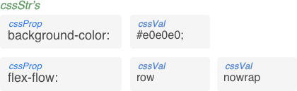

# Developers Guide

To most effectively review and contribute to the codebase, it is important to gain a solid understanding of the core concepts and terminology used by the Atomics library.

> NOTE:
  Terms are identified by their full name upon introduction.  After that, camel case versions of the terms are used, which reflect variable/fxn naming conventions used throughout the code.  Here is a quick list of those terms


| Term             | In code     | What it is
|------------------|-------------|------------
| CSS String       | cssStr      |
| CSS Property     | cssProp     |
| CSS Value        | cssVal      |
| CSS Key          | cssKey      |
| CSS Map          | cssMap      |
| CSS Map Function | cssMapFn    |
| CSS Template     | cssTemplate |
| atomic Function  | atomicFn    |


## CSS Strings

You already know what a `CSS String` is.  It's that thing that you use in your CSS and inline styling to apply a style to a DOM element, for example:

```css
background-color: #e0e0e0;
flex-flow: row nowrap
```

From an Atomics point of view, each `cssStr` is made up of one `CSS Property` and one or more `CSS Values`




## CSS Mapping

Atomics makes extensive use of CSS mapping.  `CSS Maps` are defined for each of the various categories of `cssVals`.  For example maps are defined for spacing values, color values, and flex box values.

Each `cssMap` defines a translation from a set of normalized, possibly abbreviated, human readable `CSS Keys` to standard `cssVals`.  A map may also include a unit that applies to it's `cssVals`.

For each `cssMap`, a corresponding css mapping function is defined, which map a `cssKey` to a `cssVal`.

If a `cssMapFn` receives a value that does not correspond to any `cssKey` defined in the corresponding `cssMap`, it simply returns the value it was supplied (this add lots of flexibility, as you will see)

As an example lets have a look at the spacing keyMap.  This map defines a set of `cssKeys` that represent normalized spacing identifiers which map to standard CSS spacing values and units.

```javascript
const spacingKeyMap = {
  unit: 'rem',
  vals: {
    0:       0,
    1:       0.25,
//  |        |
//  cssKeys  cssVals
//  ...
  }
};

`margin: ${mapSpace(0)}`; // -> 'margin: 0rem'
`padding: ${mapSpace(0)} ${mapSpace(1)}`; // -> 'padding: 0rem 0.25rem'
`padding-top: ${mapSpace('80px')}; // -> 'padding-top: 80px'
```

Notice that `cssVals` for a specific category (spacing values in the example above), can be valid for different `cssProps`.  For example, spacing values apply to  **margin**, **padding**, and other `cssProps`. Also notice, in the last example, the input does not correspond to a `cssKey`, and was simply passed through.

The next example illustrates how `cssMaps` can be used to define human readable `cssKeys`

```javascript
const colorKeyMap = {
  unit: '',
  vals: {
     'red-700':   '#d32f2f',
     'grey-100':  '#fafafa',
//    |           |
//    cssKeys     cssVals
//    ...
  }
};

`color: ${mapColor('red-700')}`; // -> 'color: #d32f2f'
`background-color: ${mapColor('grey-100')}`; // -> 'background-color: #fafafa'
```

This example shows that cssMaps can be used to define terse, easy to type, cssKeys

```javascript
export const flexKeyMap = {
  unit: '',
  vals: {
    fs:      'flex-start',
    fe:      'flex-end',
    c:       'center',
//  |         |
//  cssKeys   cssVals
//  ...
  }
};

`align-items: ${mapFlex('fs')}` // -> 'align-items: flex-start'
`justify-content: ${mapFlex('c')}` // -> 'justify-content: center'
```

**TBD** talk about concrete vs. virtual css maps

So, you are probably thinking why in the heck would I want to go to all of this work: `padding: ${mapSpace(0)} ${mapSpace(1)}`, when I could just type `padding: 0rem 0.25rem`.  Rest assured, it's part of a bigger plan that enables concise, flexible and composable functional styling ;)

## CSS Templates

`cssTemplates` look like this

```
padding: $1 $2 $3 $4
order: ^1
```

They are really just `cssStrs` with place holders for future `cssVals`.  There are two types of place holders:
* `$n`: replace with a `cssVal` derived by calling a specified `cssMapFn` which is invoked with a given `cssKey`
* `^n`: replace directly the with the supplied value (i.e. no `cssMapFn` applied)

For example
```javascript
fillCssTemplate('cyan-300',      'color: $1',      mapColor)     // -> 'color: #4dd0e1;'
fillCssTemplate([8, 12],         'padding: $1 $2', mapSpace)     // -> 'padding: 2rem 3rem;'
fillCssTemplate([1, 2, '100px'], 'flex: ^1 ^2 ^3'  //not needed) // -> 'flex: 1 2 100px;'
//               |                |                |
//               cssVals          cssTemplate      cssMapFn
```

## CSS Specifications

TBD


## Atoms

Atoms are at the heart of `atomics`.  The `atoms` object holds all information needed to apply atomic styles.  At a high level, the `atoms` object looks like this:
```
// atoms = {
//   pt : { <-- atom type
//     1:            'padding-top: 0.25rem', <-- this entire row is an atom
//     2:            'padding-top: 0.5rem'   <-- this is another atom
//     ^              ^
//     cssSpec        cssStr (css string)
//
//   c : { <-- a second atom type
//     red:           'color:     #c62828',  <-- an atom, applied via atomic fxn c('red')
//   }                ^cssProp    ^cssVal
// }
```

## Atomic Functions

TBD: each atomicFn represent an atomType

Atomic functions (`atomicFns`) are called by clients in order to construct a `cssStr`.

Recall that a `cssStr` is a css styling statement that can be applied to a DOM element, and is made up of a `cssProp` and one or more `cssProps`.  Here are some example `cssStrs`:
```
  color:          red;
  padding:        0.25rem 0.5rem;
  flex-direction: column;
  |               |
  cssProp         cssVal(s)
```

Each atomic function name is an abbreviated representation of a `cssProp`, Here are some example `atomicFns`
```
c()   // reprersents the cssProp "color:"
p()   // reprersents the cssProp "padding:"
mt()  // reprersents the cssProp "margin-top:"
fxd() // reprersents the cssProp "flex-direction:",
```

Atomic functions can receive on or more `cssKeys`.  Behind the scenes the supplied `cssKeys` are mapped to `cssVals`.  For example:
```
c('cyan-300`) // -> "color: #c62828;"
p(8, 12)      // -> "padding: 2rem 3rem;"
fxd('rcol')   // -> "flex-direction: reverse-column"
```

`atomicFns` can also receive raw `cssVals` (i.e. values that don't correspond to `cssKeys` in the associated `cssMap`). In this case the `cssVals` are directly inserted into the `cssStr`, for example
```
c('#010101`) // -> "color: #010101;"
p('24px`)    // -> "padding: 24px;"
```

`atomicFns` can also receive a mixture of `cssKeys` and raw `cssVals`, for example
```
p(24, '24px`) // -> "padding: 6rem 24px;"
```

// TBD: example of using atomic fxn as input for style='xxx' for dome
// TBD: example of using atomic fxn + emotion as input for className='yyy'


## Atomic Maps

## Modifiers
